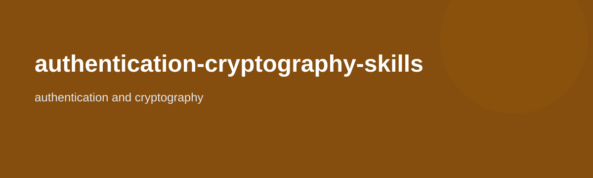

# authentication-cryptography-skills

<p align="center">
  
</p>

<p align="center">
  
</p>

<p align="center">
  <a href="LICENSE"></a>
  
  
</p>

A platform-neutral authentication and cryptography skill pack for password policy, token auth, challenge-response, certificate chains, revocation, and MITM exposure review.

## Included skills

- `biometric-auth-risk-reviewer`
- `ca-ra-role-explainer`
- `certificate-chain-reviewer`
- `certificate-revocation-reviewer`
- `challenge-response-reviewer`
- `identification-vs-authentication-reviewer`
- `mitm-exposure-checker`
- `password-policy-reviewer`
- `remote-auth-protocol-reviewer`
- `token-auth-design-reviewer`
- `trust-store-reviewer`

## Features

- Preserves the original `skills/`, `templates/`, and `examples/` source material
- Mirrors packaged skills into both `.claude/skills/` and `.agents/skills/`
- Packages the source skills into a reusable public repo format

## Install

### Option A: Install globally

```bash
git clone https://github.com/45ck/authentication-cryptography-skills.git
cd authentication-cryptography-skills
bash install.sh
```

This installs every packaged skill into both:

- `~/.claude/skills/`
- `~/.agents/skills/`

### Option B: Copy into a project

```bash
cp -R .claude /path/to/your-project/
cp -R .agents /path/to/your-project/
```

### Uninstall

```bash
bash uninstall.sh
```

## Usage

```text
/password-policy-reviewer current auth rules
/token-auth-design-reviewer session and refresh tokens
/remote-auth-protocol-reviewer SSO flow
/challenge-response-reviewer device verification flow
/certificate-chain-reviewer current TLS chain
/mitm-exposure-checker mobile API connection path
```

## Repo structure

```text
skills/                              original source skills
templates/                           reusable templates
examples/                            sample flow material
.claude/skills/<skill>/SKILL.md      packaged skill format
.agents/skills/<skill>/SKILL.md      mirrored packaged skill format
install.sh                           global installer
uninstall.sh                         global uninstaller
LICENSE                              MIT
```

## Related skill packs

- [business-analysis-skills](https://github.com/45ck/business-analysis-skills) - Business analysis techniques, workflows, and quality checks
- [marketing-product-skills](https://github.com/45ck/marketing-product-skills) - Product strategy, growth, positioning, launch, SEO, and pricing skills
- [hci-review-skill](https://github.com/45ck/hci-review-skill) - Structured HCI and UX review skills
- [fagan-inspection-skill](https://github.com/45ck/fagan-inspection-skill) - Formal inspection and defect-review skills
- [software-architecture-skills](https://github.com/45ck/software-architecture-skills) - Architecture options, views, risks, and tradeoff writing
- [data-structures-algorithmic-reasoning-skills](https://github.com/45ck/data-structures-algorithmic-reasoning-skills) - Data structure selection and algorithmic reasoning skills
- [oop-code-structure-skills](https://github.com/45ck/oop-code-structure-skills) - Object-oriented design and class-structure review skills
- [web-engineering-skills](https://github.com/45ck/web-engineering-skills) - Web request handling, MVC, validation, routing, and navigation skills
- [backend-persistence-skills](https://github.com/45ck/backend-persistence-skills) - Persistence, schema, ORM, query, and migration skills
- [enterprise-architecture-integration-skills](https://github.com/45ck/enterprise-architecture-integration-skills) - Enterprise topology, integration, messaging, and cloud skills
- [uml-analysis-modelling-skills](https://github.com/45ck/uml-analysis-modelling-skills) - UML analysis and modelling skills
- [verification-test-design-skills](https://github.com/45ck/verification-test-design-skills) - Verification, coverage, decision-table, and oracle design skills
- [automation-testing-skills](https://github.com/45ck/automation-testing-skills) - Unit, integration, API, UI, regression, and flaky-test skills
- [non-functional-testing-skills](https://github.com/45ck/non-functional-testing-skills) - Performance, resilience, scalability, soak, stress, and NFR testing skills
- [software-quality-skills](https://github.com/45ck/software-quality-skills) - Quality models, technical debt, maintainability, and reliability skills
- [code-review-inspection-skills](https://github.com/45ck/code-review-inspection-skills) - Formal inspection, checklist-driven review, metrics, and rework planning skills
- [refactoring-code-smells-skills](https://github.com/45ck/refactoring-code-smells-skills) - Refactoring, anti-pattern, duplication, and code smell review skills
- [design-for-testability-skills](https://github.com/45ck/design-for-testability-skills) - Seams, DI, determinism, hidden I/O, and testability design skills
- [security-engineering-skills](https://github.com/45ck/security-engineering-skills) - Threat modeling, boundaries, least privilege, and secure defaults skills
- [pentest-security-testing-skills](https://github.com/45ck/pentest-security-testing-skills) - Pentest scoping, recon, attack-surface mapping, OWASP, and finding-report skills
- [llm-agent-security-skills](https://github.com/45ck/llm-agent-security-skills) - Prompt injection, agent permissions, retrieval trust, memory, and tool-chain security skills
- [deployment-release-skills](https://github.com/45ck/deployment-release-skills) - Deployment strategy, go-live readiness, rollback, and release operations skills
- [maintenance-evolution-skills](https://github.com/45ck/maintenance-evolution-skills) - Maintenance triage, change impact, migration, regression, and deprecation skills
- [project-management-skills](https://github.com/45ck/project-management-skills) - Project chartering, scope, WBS, milestones, estimation, and closure skills
- [agile-delivery-skills](https://github.com/45ck/agile-delivery-skills) - Backlog shaping, sprint goals, retrospectives, blockers, and delivery discipline skills

## License

[MIT](LICENSE)
